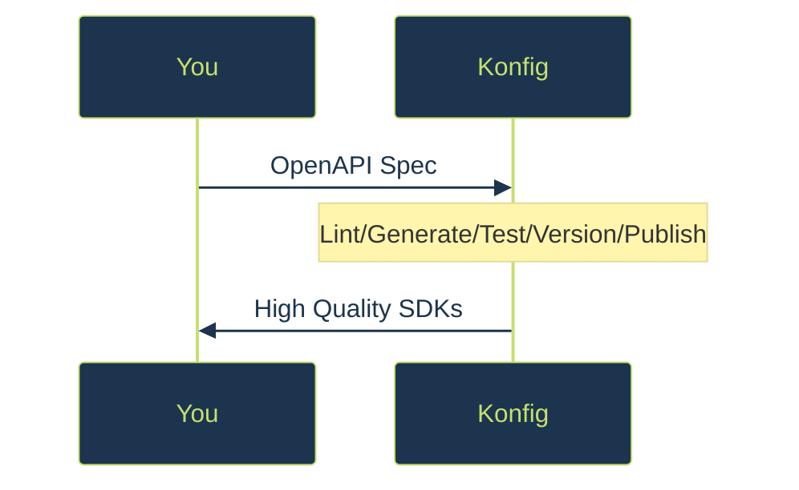
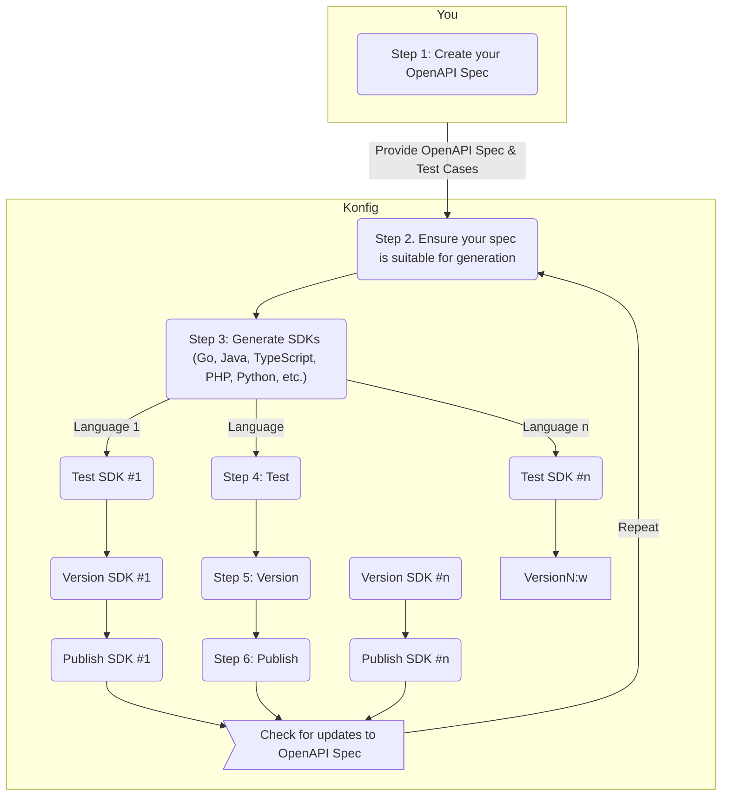
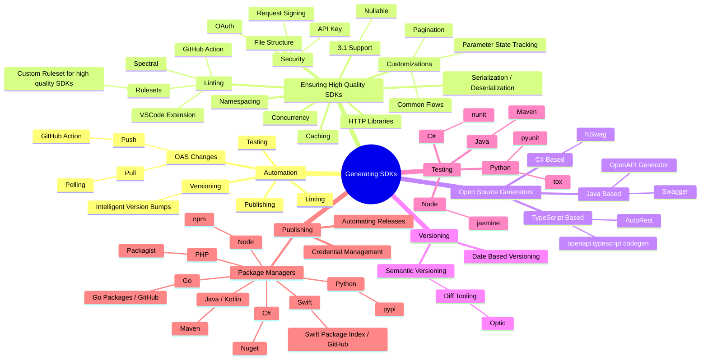

# Collaboration with Konfig

```mermaid
%%{
  init: {
    'theme': 'base',
    'themeVariables': {
      'primaryColor': '#1c344d',
      'primaryBorderColor': '#c6e070',
      'primaryTextColor': '#c6e070',
      'activationBkgColor': '#1c344d',
      'loopTextColor': '#1c344d',
      'signalColor': '#1c344d',
      'signalTextColor': '#1c344d'
    }
  }
}%%

sequenceDiagram
    You->>Konfig: OpenAPI Spec
    Note over Konfig: Lint/Generate/Test/Version/Publish
    Konfig->>You: High Quality SDKs
```

# Steps to generate SDKs

```mermaid
flowchart TD
    subgraph You
      A("Step 1: Create your OpenAPI Spec")
    end
    subgraph Konfig
      direction TB
      Lint(Step 2. Ensure your spec is suitable for generation)
      Generate("Step 3: Generate SDKs (Go, Java, TypeScript, PHP, Python, etc.)")
      Test1(Test SDK #1)
      Version1(Version SDK #1)
      Publish1(Publish SDK #1)
      TestN(Test SDK #n)
      VersionN(Version SDK #n)
      PublishN(Publish SDK #n)
      Check>Check for updates to OpenAPI Spec]
      Test(Step 4: Test)
      Version(Step 5: Version)
      Publish(Step 6: Publish)
      Lint --> Generate
      Generate -->|Language 1| Test1
      Generate -->|Language| Test
      Generate -->|Language n| TestN
      Test1 --> Version1
      Test --> Version
      TestN --> VersionN:w

      Version1 --> Publish1
      Version --> Publish
      VersionN --> PublishN
      Publish1 & Publish & PublishN --> Check
      Check -->|Repeat| Lint
    end
    You -->|Provide OpenAPI Spec & Test Cases| Lint
```

# Mindmap of SDK Generation

```mermaid
mindmap
  root((Generating SDKs))
    Automation
      OAS Changes
        Push
          GitHub Action
        Pull
          Polling
      Versioning
        Intelligent Version Bumps
      Linting
      Testing
      Publishing
    Ensuring High Quality SDKs
      Linting
        Spectral
        Rulesets
          Custom Ruleset for high quality SDKs
        GitHub Action
        VSCode Extension
      Security
        Request Signing
        OAuth
        API Key
      Customizations
        Common Flows
        Pagination
        Parameter State Tracking
      Serialization / Deserialization
      File Structure
      Namespacing
      HTTP Libraries
      Caching
      Concurrency
      3.1 Support
        Nullable
    Open Source Generators
      Java Based
        Swagger
        OpenAPI Generator
      C# Based
        NSwag
      TypeScript Based
        AutoRest
        openapi typescript codegen
    Versioning
      Date Based Versioning
      Semantic Versioning
        Diff Tooling
            Optic
    Testing
      C#
        nunit
      Java
        Maven
      Python
        tox
        pyunit
      Node
        jasmine
    Publishing
      Automating Releases
      Credential Management
      Package Managers
        C#
          Nuget
        Java / Kotlin
          Maven
        Node
          npm
        Python
          pypi
        PHP
          Packagist
        Swift
          Swift Package Index / GitHub
        Go
          Go Packages / GitHub
```
