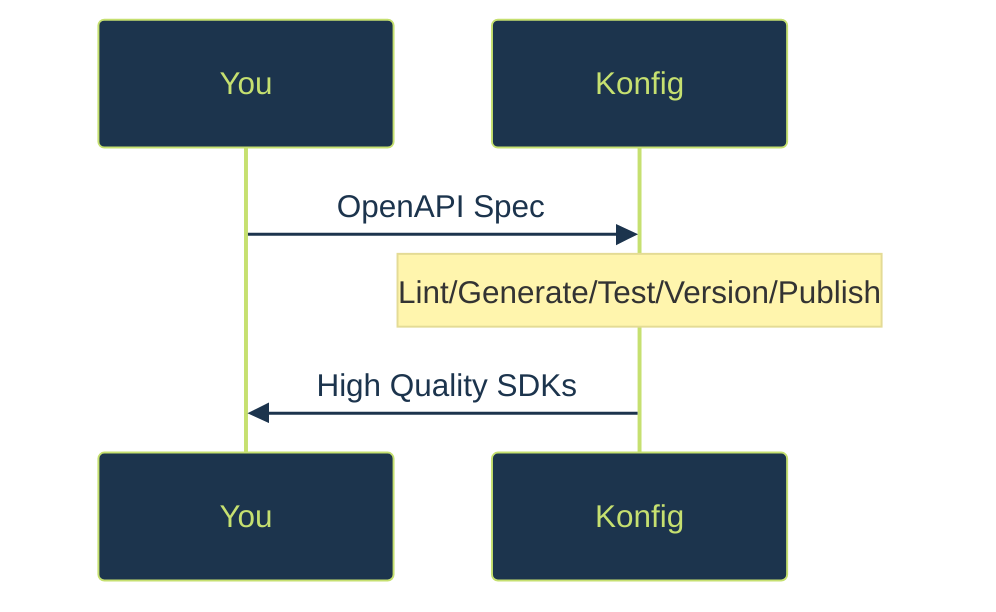
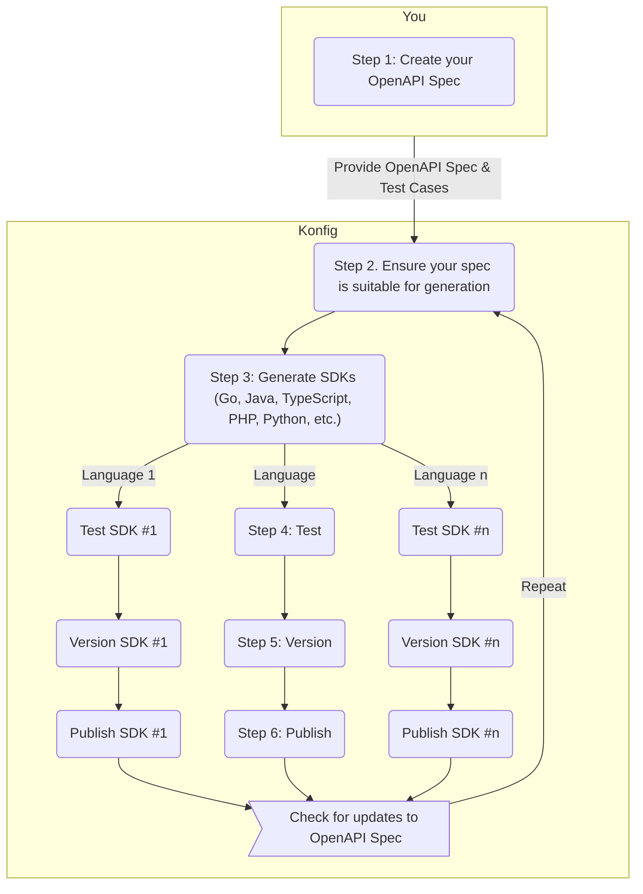

# Collaboration with Konfig

```mermaid
%%{
  init: {
    'theme': 'base',
    'themeVariables': {
      'primaryColor': '#1c344d',
      'primaryBorderColor': '#c6e070',
      'primaryTextColor': '#c6e070',
      'activationBkgColor': '#1c344d',
      'loopTextColor': '#1c344d',
      'signalColor': '#1c344d',
      'signalTextColor': '#1c344d'
    }
  }
}%%

sequenceDiagram
    You->>Konfig: OpenAPI Spec
    Note over Konfig: Lint/Generate/Test/Version/Publish
    Konfig->>You: High Quality SDKs
```

# Steps to generate SDKs

```mermaid
flowchart TD
    subgraph You
      A("Step 1: Create your OpenAPI Spec")
    end
    subgraph Konfig
      direction TB
      Lint(Step 2. Ensure your spec is suitable for generation)
      Generate("Step 3: Generate SDKs (Go, Java, TypeScript, PHP, Python, etc.)")
      Test1(Test SDK #1)
      Version1(Version SDK #1)
      Publish1(Publish SDK #1)
      TestN(Test SDK #n)
      VersionN(Version SDK #n)
      PublishN(Publish SDK #n)
      Check>Check for updates to OpenAPI Spec]
      Test(Step 4: Test)
      Version(Step 5: Version)
      Publish(Step 6: Publish)
      Lint --> Generate
      Generate -->|Language 1| Test1
      Generate -->|Language| Test
      Generate -->|Language n| TestN
      Test1 --> Version1
      Test --> Version
      TestN --> VersionN
      Version1 --> Publish1
      Version --> Publish
      VersionN --> PublishN
      Publish1 & Publish & PublishN --> Check
      Check -->|Repeat| Lint
    end
    You -->|Provide OpenAPI Spec & Test Cases| Lint
```
